# Architecture

## Runtime Overview

The application is one App Router page. `app/page.tsx` mounts the client-side `BirthdayExperience`, which owns the story state machine and composes persistent or phase-specific Three.js canvases with React overlays.

```mermaid
flowchart LR
  scanner["scanner"] -->|Open portal| portal["portal"]
  portal -->|Click gun| charging["portal charging"]
  charging -->|1.18 s| ready["portal ready"]
  ready -->|Click portal| travel["travel"]
  travel -->|2.85 s| lab["lab"]
  lab -->|Use analysis station| analysis["analysis"]
  analysis -->|Click result portal| finalDialog["final dialogue"]
  finalDialog -->|11.8 s| epilogue["final epilogue"]
```

`GamePhase` is defined in `src/data/story.ts`. The initial value in `BirthdayExperience` must remain `scanner` outside temporary local verification.

## Source Ownership

| File | Responsibility |
| --- | --- |
| `app/layout.tsx` | Russian document language, metadata, and global CSS import. |
| `app/page.tsx` | Route entry point; mounts the birthday experience. |
| `app/globals.css` | All layout, overlay, modal, responsive, and visual-effect styles. |
| `src/components/BirthdayExperience.tsx` | Phase state, GSAP timelines, story timers, music start, photo/customizer modals, analysis HUD, final dialogue, and epilogue. |
| `src/components/PortalVerseCanvas.tsx` | Persistent portal-space WebGL canvas, portal and gun loading, raycast targets, beam geometry, particles, and phase-dependent visibility. |
| `src/components/GarageSceneCanvas.tsx` | Garage WebGL world, third-person movement, camera, collision, photos, analysis station, mirror, sports balls, prompts, and garage asset loading. |
| `src/components/playerShell.ts` | Procedural visible player, facial states, hair, clothing colors, sneakers, and walk/jump-compatible shell animation. |
| `src/components/CharacterPreviewCanvas.tsx` | Orthographic live preview for the mirror customizer using the shared player shell. |
| `src/components/CharacterModelsCanvas.tsx` | Final left/right scientist and companion models and their simple idle/exit animation. |
| `src/data/story.ts` | Editable celebrant data, scanner rows, profile stats, photo ids, achievements, garage readouts, and structured final dialogue. |
| `src/data/characterCustomization.ts` | Customization types, defaults, color options, face options, and hair options. |
| `src/hooks/usePortalAudio.ts` | Web Audio effects created after user gestures. |

## State And Data Flow

`BirthdayExperience` owns these user-visible states:

- `phase`: current story scene.
- `scannerReady`: scanner profile/CTA reveal status.
- `portalCharging` and `portalReady`: gun-to-portal sequence.
- `analysisComplete`: reveals and enables the manual portal action beside the analysis result frame.
- `finalClosed`: switches from dialogue to the final birthday epilogue.
- `openPhotoId`: selected memory modal.
- `customizerOpen`: mirror editor modal.
- `characterCustomization`: shared values used by the garage player and live preview.

Three.js callbacks return user actions to `BirthdayExperience`:

- portal gun raycast -> `firePortalGun()`;
- portal raycast -> `enterPortal()`;
- garage analysis station -> `startAnalysis()`;
- analysis result portal -> `continueFromAnalysis()`;
- garage photo -> `openPhoto(photoId)`;
- garage mirror -> `openCustomizer()`.

Story copy should remain centralized in `src/data/story.ts`. Geometry placement and interaction radii belong to the owning Three.js component, not the story file.

## Rendering Layers

### Portal Space

`PortalVerseCanvas` stays mounted across phases. It controls visibility and animation from refs so the Three.js scene is not rebuilt on every React state change. It loads:

- `/assets/portal-3d/green-portal.glb`;
- `/assets/portal-gun/portal-gun.fbx`.

Gun and portal clicks are real Three.js raycasts against invisible 3D targets. The beam is a cylinder between the configured barrel and portal endpoints.

### Garage

`GarageSceneCanvas` renders two scenes with one camera:

1. the room, imported garage, lights, photos, props, and interactions;
2. the procedural player and any currently carried sports ball after `renderer.clearDepth()`.

The second pass keeps the player readable above garage/photo materials. It has neutral hemisphere and directional lights because a carried ball retains its lit standard material after it is temporarily attached to the player root. The attachment gives the ball the same transform and render pass while the character turns. Player collision is calculated from `WALKABLE_FLOOR` minus `BLOCKED_FLOOR_AREAS`. The chase camera separately raycasts from its look target toward its desired position and clamps itself in front of room or furniture geometry, preventing the view from crossing outside the garage shell.

The imported garage FBX is the visual environment. The room shell provides dependable floor/wall coverage. The imported `Background` billboard is not the active environment.

### Character Customizer

The garage character and modal preview both call `createVisiblePlayerShell()` and `applyPlayerCustomization()`. This shared geometry is the contract that keeps editor choices identical in both places. The preview uses an orthographic camera and does not recreate the player on every option change.

### Final Scene

`CharacterModelsCanvas` loads the final scientist and companion assets and stages them outside the centered dialogue panel. After the dialogue timeout, the models scale down and the epilogue plus transparent final character asset appear.

## Timing Ownership

All narrative timers are in `BirthdayExperience.tsx`:

- scanner row rhythm: `0.62 s` plus the dedicated correction pause;
- portal charging: `1180 ms`;
- travel: `2850 ms`;
- analysis complete sound/state: `7600 ms`;
- analysis to final: manual click on the enabled result portal;
- final dialogue to epilogue: `11800 ms`.

When timing changes, verify that content remains readable and that cleanup clears every timer when the phase changes.

## Tuning Map

| Area | Primary constants |
| --- | --- |
| Portal gun pose and hitbox | `PORTAL_GUN_TUNING` |
| Portal beam endpoints | `PORTAL_BEAM_TUNING` |
| Portal hit area | `PORTAL_CLICK_TUNING` |
| Garage player/camera/movement | `PLAYER_*`, `CAMERA_HOME`, `FIXED_CAMERA_PITCH` |
| Garage walkability | `WALKABLE_FLOOR`, `BLOCKED_FLOOR_AREAS` |
| Memory photos | `PHOTO_LAYOUTS_BY_ID` |
| Analysis station | `ANALYSIS_STATION_TUNING` |
| Mirror | `MIRROR_STATION_TUNING` |
| Interaction distances | `*_INTERACTION_RADIUS` |
| Player hair/shoes | `src/components/playerShell.ts` |
| Customizer framing | `PREVIEW_*` constants |
| Final model staging | group positions in `CharacterModelsCanvas.tsx` |

Read `docs/GARAGE_SCENE_GUIDE.md` before changing garage coordinates, collision, player geometry, photo placement, the mirror, or sports props.

## Styling Organization

The project intentionally uses one global stylesheet. Search by the scene prefix before editing:

- `scanner-*`
- `portal-*` and `travel-*`
- `lab-*`, `garage-*`, `photo-*`, and `interaction-*`
- `analysis-*` and `achievement-*`
- `customizer-*`
- `final-*`

Keep selectors scoped to the scene prefix. Do not solve a local layout issue with a broad element selector.

## Asset Rules

- Browser-ready production files and preserved source assets live under `public/assets/`.
- URLs in source are root-relative `/assets/...` paths.
- New supplied files must be copied into the project before integration.
- Record whether an asset is active, a fallback, or source-only in `docs/ASSET_BRIEF.md`.
- Never assume an FBX/GLB includes correct materials. Inspect texture paths, material names, bounds, axis orientation, and scale.
- Public deployment requires a separate rights review for character models, music, photos, and reference-derived artwork.

## Known Constraints

- There is no unit/E2E test framework yet; verification uses TypeScript, Next build checks, browser interaction checks, and screenshots.
- The basketball `.blend` and clothing source meshes are not active browser runtime assets. Procedural fallbacks are intentional.
- The supplied sneaker FBX overlay is disabled because it duplicated geometry; the procedural high-tops are active.
- The current browser check can report an `FBXLoader` warning about negative material indices in a supplied FBX. The current scene still renders; treat it as known source-asset debt and re-evaluate it whenever an FBX or its material handling changes.
- `window.__garageDebug` exists only for hair-part tuning. Final values must be copied into source; do not expand this into production gameplay state.
- The app is desktop-first. Mobile must remain functional, but desktop framing is the current presentation target.
